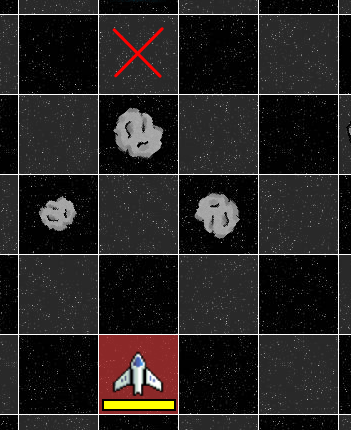

# Primer Parcial A - Abril 2026

## Ejercicio 1 { pautas }
Indicar la condicion final de la cursada de cada uno de los siguientes alumnos de AyP1:

- **Luisito:** notas en sus 4 parciales: 5, 6, 10, 10  
- **Carla:** notas en sus 4 parciales: 7, 6, 7, 7; TP: Aprobado; 65% de asistencia.  
- **Yael:** notas en sus 4 parciales: 10, 10, 4, 4; TP: Aprobado; asistió a 20 clases de 25. 

## Ejercicio 2 { algoritmos }
Se dispone de una planilla de notas en la que se tienen las notas de las M materias de los N alumnos de último año del secundario. Se desea obtener los tres alumnos con los mejores promedios para nombrarlos abanderados.
**Identificar:** datos de entrada y de salida, y definir una estrategia para resolver el problema.

## Ejercicio 3 { logo }
La tortuga comienza en (0,0) mirando hacia arriba. Se ejecuta el siguiente código. ¿Cuál es su posición final (x, y) y su orientación final? Dibujar el trayecto.

```
REPETIR 4 [
  AVANZAR 20
  GIRAR_DERECHA 45
  AVANZAR 10
  GIRAR_DERECHA 45
]
```

# Primer Parcial B - Abril 2026

## Ejercicio 1 { entropía }
Dentro de la analogía de la 'Ventana Rota', ¿cuál es el mecanismo psicológico exacto que dispara la degradación acelerada del sistema?  
A. La falta de espacio en los contenedores de basura del barrio.  
B. El deseo intrínseco de los habitantes de destruir edificios abandonados.  
C. La imposibilidad física de reparar daños estructurales serios.  
D. La percepción de que a los responsables no les importa el sistema.

## Ejercicio 2 { algoritmos }
El operador de un depósito necesita determinar cuántos paquetes pueden cargarse simultáneamente en un montacargas sin superar su capacidad máxima M en kilogramos. Los paquetes están alineados en una fila y, aunque todos tienen el mismo tamaño, su peso varía según el contenido. De cada paquete se conoce su peso y su ID. Se quiere maximizar la cantidad de paquetes transportados en un solo viaje.  
**Identificar:** datos de entrada y de salida, y definir una estrategia para resolver el problema.

## Ejercicio 3 { batalla espacial }
Dadas únicamente las siguientes instrucciones, utilizar la nave exploradora para llegar a la casilla espeficifada.
Instrucciones:

- avanzarAlNorte()  
- avanzarAlEste()  
- avanzarAlOeste()



Si cada movimiento consume 10 de combustible, ¿cuánto combustible necesitará tener la nave como mínimo para poder llegar y regresar?

# Primer Parcial C - Abril 2026

## Ejercicio 1 { uso de IA }
Si un estudiante puede explicar su código línea por línea pero no sabe qué cambiar si se modifica una condición del problema, ¿cuál es la conclusión según el texto?  
A. La IA ha realizado un trabajo de explicación efectivo y suficiente.  
B. El estudiante aún no posee una señal real de aprendizaje profundo.  
C. El estudiante ha cumplido con el requisito principal del uso académico.  
D. El estudiante está preparado para el examen parcial sin ayuda externa.

## Ejercicio 2 { algoritmos }
La caja de un supermercado registra los productos que compra un cliente. Cada producto tiene un código, un precio unitario y una cantidad. Al finalizar la compra, la caja debe emitir el ticket con el total a pagar.  
**Identificar:** datos de entrada y de salida, y definir una estrategia para resolver el problema.

## Ejercicio 3 { logo }
La tortuga comienza en (0,0) mirando hacia arriba. Se ejecuta el siguiente código. ¿Cuál es su posición final (x, y) y su orientación final? Dibujar el trayecto.

```
REPETIR 3 [
  AVANZAR 10
  GIRAR_DERECHA 90
  AVANZAR 10
  GIRAR_IZQUIERDA 90
]
```
